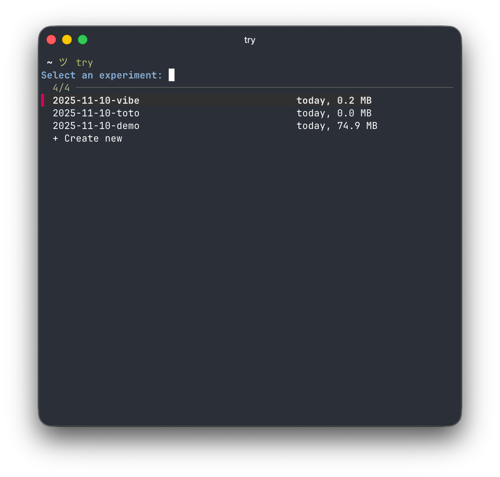

# try.sh — fzf-powered lightweight experiment manager


*Your experiments deserve a home.* 🏠

> A minimalist Bash reimplementation of [tobi/try](https://github.com/tobi/try), using `fzf` for navigation.  
> Designed for developers who like to spin up quick, disposable projects and keep them somewhat organized.

---

## ✨ What It Does

Tired of directories like `test`, `test2`, `new-test`, or `tmp-stuff` scattered everywhere?

**try.sh** creates and manages timestamped folders for your experiments:
- **Instant fuzzy search** via [`fzf`](https://github.com/junegunn/fzf)
- **Smart age display** (days, weeks, months)
- **Auto-dated directories** (`2025-11-10-my-experiment`)
- **Quick project cloning** via Git (auto-detects Git URLs)
- **Plugin system** for scaffolding projects (Laravel, React, etc.)
- **Extension catalog** for easy plugin installation
- **Simple Bash script — minimal dependencies**



---

## 🚀 Quick Start

```bash
curl -sL https://raw.githubusercontent.com/c4software/try.sh/main/try.sh -o ~/.local/bin/try
chmod +x ~/.local/bin/try

echo 'eval "$(~/.local/bin/try init)"' >> ~/.zshrc # or ~/.bashrc
```

### Dependencies

**Required:**
* `fzf` (for interactive selection)
* `git` (for cloning repositories)
* [`gum`](https://github.com/charmbracelet/gum) (for confirmation prompts)

**Optional (for extension management):**
* `curl` (for downloading extensions)
* `jq` (for parsing extension catalog)

---

## 🧠 Usage

```bash
try                            # Browse and open experiments interactively
try .                          # Create a new project from the current directory
try <query>                    # Search for a matching directory or create it
try clone <uri> [name]         # Clone a git repository into TRY_PATH
try list|ls                    # List all projects with size and last modified date
try make <plugin> [name]       # Create project using a plugin (e.g., laravel)
try extension list             # List available extensions from catalog
try extension install <name>   # Install an extension from catalog
try init                       # Initialize try (create tries directory)
try prune                      # Clear out all projects
try --help                     # Show help
```

Examples:

```bash
try redis
try .                                              # Create from current directory
try https://github.com/tobi/try.git               # Auto-detects Git URL
try clone https://github.com/tobi/try.git
try make laravel my-app                            # Create Laravel project
try extension install laravel                      # Install Laravel extension
try list
```

---

## 🧭 Example session

```bash
$ try redis
→ 2025-11-09-redis-cache         1d, 22.3 MB
  2025-10-30-redis-test          2w, 18.5 MB
  ➕ Create new
```

Press <kbd>Enter</kbd> to open, or create a new project if none exists.

---

## 🛠️ Features

### 🔍 Fuzzy Project Search

* Real-time search powered by `fzf`
* Displays project age and size
* Delete projects with <kbd>Ctrl-D</kbd>
* Automatically creates new directories if no match is found

### 🕓 Smart Date Prefixes

* Automatically prefixes new projects with today’s date:

```sh
2025-11-10-laravel-playground
```

### 🧰 Git Integration

Clone repositories directly:

```bash
try clone https://github.com/user/repo.git
# → ~/src/tries/2025-11-10-user-repo
```

Or just pass a Git URL directly:

```bash
try https://github.com/user/repo.git
# Auto-detects and clones automatically
```

### 🔌 Plugin System

Create pre-configured projects using plugins:

```bash
try make laravel my-app
# Creates a new Laravel project with all dependencies
```

Plugins are stored in `~/.config/try/` and can scaffold entire project structures.

### 📦 Extension Catalog

Browse and install community extensions:

```bash
# List available extensions
try extension list

# Install an extension
try extension install laravel
```

Extensions are downloaded from the official catalog and ready to use immediately.

### 📂 Create from Current Directory

Quickly convert your current directory into a try experiment:

```bash
cd ~/my-project
try .
# Copies current directory contents to a new timestamped experiment
```

### 🗑️ Safe Deletion

Delete projects directly from the TUI with <kbd>Ctrl-D</kbd> (confirmation required).

---

## ⚙️ Configuration

Change the default storage path:

```bash
export TRY_PATH=~/code/experiments
```

Default: `~/src/tries`

---

## 🧩 Keyboard Shortcuts

| Key / Combo     | Action                          |
| --------------- | ------------------------------- |
| ↑ / ↓, Ctrl+J/K | Navigate                        |
| Enter           | Open or create a project        |
| Ctrl+D          | Delete a project (confirmation) |
| Esc / Ctrl+C    | Cancel / quit                   |

---

## 💡 Philosophy

You have ideas. You try things. You forget where you put them.
**try.sh** brings order to creative chaos — every experiment gets a name, a date, and a home.

---

## 📝 License

MIT — do whatever you want with it.

---

### Credits

* Original concept and design: [tobi/try](https://github.com/tobi/try) (Ruby version)
* Bash reimplementation by [@c4software](https://github.com/c4software)
